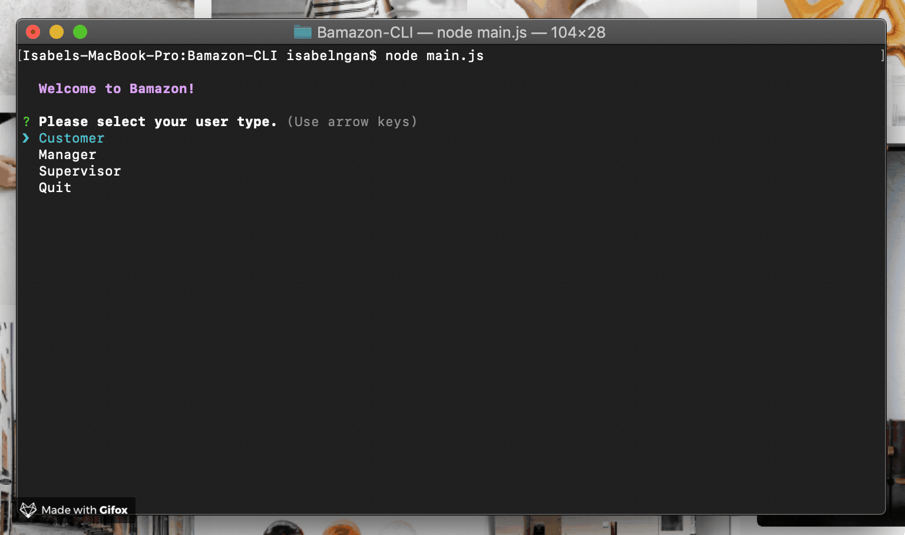
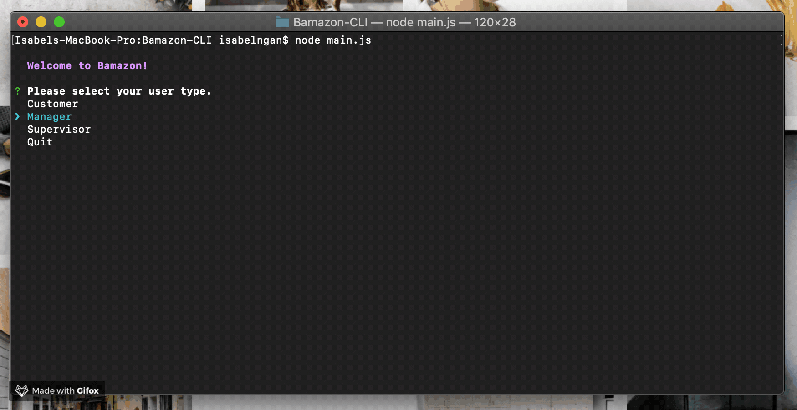
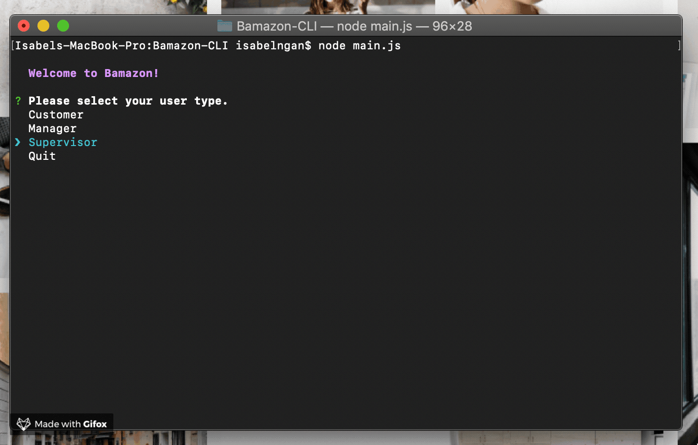

# Bamazon-CLI
CLI "Amazon" storefront,the best place to shop!
###### (Besides actual Amazon)

## How does it work?
The app starts by running main.js in your command-line interface. You'll be greeted with an option to proceed as a Bamazon Customer, Manager or Supervisor.

###### (If tables look strangley formatted, just widen your terminal window)
## Customer View
As a Customer, you will be shown a table of the current items for sale on Bamazon. You will then be prompted to enter the ID of the item you want, as well as how much of it you want to buy. (There's content validation on this, so don't go trying to buy an item that doesn't exist or entering in an impossible quantity!)

After you've correctly entered a product ID and a quantity, you'll be shown your total and asked to confirm your order. If you confirm, your order will be completed, and the remaining stock of the item you purchased will be updated accordingly.

Whether you confirm or cancel your order, you'll be asked if you'd like to make another purchase, giving you another chance to spend to your heart's content!

See the Customer view in action here. (Video file is also in this repo under assets/.)

## Manager View
As a Manager, you can do one of four things: view products for sale, view low inventory, add to inventory or add a new product.

Selecting "View Products for Sale" will show you a table of all the current items for sale on Bamazon. Note that, unlike the Customer, the Manager can also see total product sales for a given item.

Selecting "View Low Inventory" will show you a table of all the current items for sale on Bamazon that have less than 5 units in stock.

Selecting "Add to Inventory" will prompt you to enter the product ID of the product you would like to update, followed by the number of units you would like to add. The stock quantity of that item will be immediately updated.

Lastly, selecting "Add New Product" will prompt you to enter the name, department, price and stock quantity of the product you would like to add.

Select "Quit" if you would like to exit the Manager view.

See the Manager view in action here. (Video file is also in this repo under assets/.)

## Supervisor View
Last but not least! The Supervisor view lets you easily keep an eye on sales performance by department. Hit "View Product Sales by Department" to see a table of aggregated product sales for each department, as well as total profit, calculated as product sales minus overhead costs. As customers purchase items, these numbers will be updated.

You can also add a new department to keep track of. Simply choose "Create New Department" and enter the department's name and overhead costs. Note that you cannot create a department that already exists.

See the Supervisor view (in tandem with the Customer and Manager views) in action here. (Video file is also in this repo under assets/.)

### Happy shopping!

# 

### Areas for further development
* Restart main menu after ending interaction as Customer, Manager or Supervisor
* Make it easier for Customer to quit at any point of the transaction
* Manager should not be able to add a product with a department name that Supervisor has not already created

##### Week 12 assigment for the June 2019 cohort of UCLA Boot Camp. Built using JavaScript, Node, Inquirer, MySQL.
